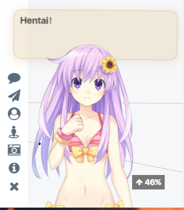

Hexo博客本身是支持看板娘的，但是原本的只有一个人物，这里使用[stevenjoezhang](https://github.com/stevenjoezhang/live2d-widget)大佬的魔改版，一个可以说话，可以换装的看板娘。
> 注意：如果你并不熟悉 Git，也不熟悉 GitHub ，那么请先 Google 了解基本使用。

<!-- more -->	

## 基本使用

请先仔细阅读项目的`README.md`文件。看板娘需要<font color='red'>Font Awesome</font>的支持，别忘了引入到自己的博客。

> 如果网页中已经加载了 Font Awesome，就不要重复加载了

向 Next 中添加看板娘，找到`head.swig`文件，在最后添加如下代码:
```js
<!-- 引入看板娘 -->

<script src="https://cdn.jsdelivr.net/gh/stevenjoezhang/live2d-widget@latest/autoload.js"></script>

```
编辑主题配置文件，在最后添加如下内容：
```yml
# 启用看板娘
live2d:
  enable: true
```
重新部署博客`hexo s --debug`打开浏览器输入[http://localhost:4000/](http://localhost:4000/)大概默认效果如下：


## 个性定制

1.将 [live2d-widget](https://github.com/stevenjoezhang/live2d-widget) 项目`Fork`一份到自己的仓库，`git clone`到本地电脑。

> 项目配置文件说明
> - `autoload.js`：自动加载看板娘
> - `waifu.css`：看板娘样式
> - `waifu-tips.js`：看板娘说话的脚本
> - `waifu-tips.json`：看板娘说话的内容

2.`autoload.js`的开头定义了加载看板娘的路径，这里替换为自己仓库的地址：


- <font color='red'>注意：`CodeHaotian` 请替换为自己的github用户名。由于使用jsdelivr提供的cdn服务，需要发布版本，@后面为等下发布的版本号。</font>

3.在`waifu.css`中修改看板娘样式，属性都可通过浏览器控制台查看变化找寻。


4.修改`waifu-tips.js`中的初始加载模型，当进行角色时切换编号会在浏览器`Console`中有输出，选择一款喜欢的做初始样式。


5.将修改后的版本提交到自己的仓库，为使用免费cdn服务，需进行新版本发布。

```shell
git add .
git commit -m "new live2d widget"
git push origin master
```


6.打开`head.swig`文件，修改为最新发布的版本：

```js
 <!-- 引入看板娘,记得更改为自己的用户名和版本号，或者直接最新 -->

<script src="https://cdn.jsdelivr.net/gh/CodeHaotian/live2d-widget@latest/autoload.js"></script>

```
7. 重新部署博客，效果如下：

